# Deployment of a Scalable University Event Management System on AWS

**Course:** CE 313 — Cloud Computing / Computer Communications & Networks
**Student:** Dara Shikoh Bodla
**Registration No:** 2023176
**Institute:** Ghulam Ishaq Khan Institute of Engineering Sciences and Technology

---

## 1. Executive Summary

UniEvent is a cloud-hosted web application that enables university students to browse events, register for activities, and upload event-related media. Rather than relying on manual data entry, the system automatically fetches live event data from the **Ticketmaster Discovery API** and presents them as official university events. The application is deployed on AWS using a fault-tolerant, secure, multi-AZ architecture built with **IAM, VPC, EC2, S3, and Elastic Load Balancing**.

This report documents the complete design, deployment, and verification of the system.

---

## 2. Architecture Design

### 2.1 Architecture Diagram


### 2.2 System Operation Flow

The system operates as follows:

1. Users access the application through the **Application Load Balancer's** public DNS endpoint.
2. The ALB distributes incoming HTTP requests across two EC2 instances deployed in **separate Availability Zones** within private subnets.
3. Each EC2 instance runs a Flask application served by Gunicorn. A background thread periodically calls the **Ticketmaster Discovery API** to fetch event data every 30 minutes.
4. Retrieved event images are mirrored into an **S3 bucket** for reliable delivery. Student-uploaded posters are also stored in S3.
5. The fetched events are displayed to users as "University Events" through a responsive web interface with search and category filtering.
6. If one EC2 instance fails, the ALB automatically detects the failure through health checks and routes all traffic to the remaining healthy instance, ensuring **zero downtime**.

### 2.3 Network Topology

| Component | Configuration | Purpose |
|-----------|--------------|---------|
| VPC | `10.0.0.0/16` | Isolated network boundary for all resources |
| Public Subnet 1 | `10.0.1.0/24` (us-east-1a) | Hosts ALB node, NAT Gateway |
| Public Subnet 2 | `10.0.2.0/24` (us-east-1b) | Hosts ALB node |
| Private Subnet 1 | `10.0.10.0/24` (us-east-1a) | Hosts EC2 App Server 1 |
| Private Subnet 2 | `10.0.20.0/24` (us-east-1b) | Hosts EC2 App Server 2 |
| Internet Gateway | Attached to VPC | Internet access for public subnets |
| NAT Gateway | In Public Subnet 1 | Outbound internet for private subnets |

---

## 3. AWS Services — Design Justification

### 3.1 IAM (Identity & Access Management)

EC2 instances require read/write access to S3 for storing event images and uploaded posters. Rather than embedding AWS credentials in the application code (a security anti-pattern), an **IAM Role** (`UniEvent-EC2-Role`) is attached to the instances via an **Instance Profile**. The role grants only the minimum required S3 permissions (`PutObject`, `GetObject`, `ListBucket`, `DeleteObject`) scoped to a single bucket. Additionally, the `AmazonSSMManagedInstanceCore` policy enables secure remote management via Systems Manager without requiring SSH key distribution. This follows the **Principle of Least Privilege**.

### 3.2 VPC (Virtual Private Cloud)

The VPC provides **complete network isolation** for the application infrastructure. Resources are segmented into public and private subnets across **two Availability Zones** (us-east-1a and us-east-1b) for fault tolerance. EC2 application instances are placed in **private subnets** with no public IP addresses, making them unreachable directly from the internet. Only the ALB (in public subnets) is internet-facing. A **NAT Gateway** allows private instances to make outbound calls (to the Ticketmaster API, S3, and package repositories) without exposing any inbound ports.

### 3.3 EC2 (Elastic Compute Cloud)

Two `t3.micro` instances run the Flask application behind Gunicorn (a production-grade WSGI server with 3 worker processes). Deploying instances in **separate Availability Zones** provides redundancy — if one AZ experiences an outage, the other continues serving traffic. Each instance is bootstrapped automatically via a **User Data** script that clones the application repository, installs dependencies, creates environment configuration, and registers a systemd service for automatic restart on failure.

### 3.4 S3 (Simple Storage Service)

Amazon S3 provides **99.999999999% (11 nines) durability** for stored objects. The bucket (`unievent-media-dara26`) serves two purposes: storing event images mirrored from the Ticketmaster API, and storing student-uploaded event posters. A **bucket policy** grants public read access only to the `event-images/` and `event-posters/` prefixes, while all other objects remain private. This offloads media storage from the EC2 instances and ensures data persists independently of instance lifecycle.

### 3.5 Elastic Load Balancing (Application Load Balancer)

The ALB is the single entry point for all user traffic. It performs **health checks** by sending `GET /health` requests to each EC2 instance every 30 seconds. If an instance fails 3 consecutive health checks, the ALB marks it as unhealthy and stops routing traffic to it. When the instance recovers and passes 2 consecutive checks, traffic is automatically restored. The ALB spans both public subnets, ensuring availability even if one AZ fails.

---

## 4. External API — Selection and Justification

### 4.1 Selected API: Ticketmaster Discovery API v2

The **Ticketmaster Discovery API** was selected after evaluating multiple options including Eventbrite, PredictHQ, and SeatGeek.

| Criterion | Ticketmaster | Eventbrite | PredictHQ |
|-----------|-------------|------------|-----------|
| Authentication | Simple API key | OAuth 2.0 required | OAuth 2.0 required |
| Free tier | 5,000 requests/day | Limited | 1,000 records/day |
| Image availability | Multiple sizes per event | Limited | No images |
| Structured JSON | Excellent | Good | Good |
| Event fields | Title, date, venue, description, images, category | Title, date, venue | Title, date, category |

Ticketmaster was chosen because it provides the richest event data with the simplest authentication mechanism (a query-parameter API key), includes multiple image sizes per event, and offers a generous free tier of 5,000 requests per day.

### 4.2 API Endpoint and Data Mapping

**Endpoint:** `GET https://app.ticketmaster.com/discovery/v2/events.json`

| API Response Field | Application Field | Purpose |
|-------------------|------------------|---------|
| `name` | `title` | Event display name |
| `dates.start.localDate` | `date` | Event date |
| `dates.start.localTime` | `time` | Event time |
| `_embedded.venues[0].name` | `venue` | Venue name |
| `_embedded.venues[0].city.name` | `city` | Venue city |
| `info` or `pleaseNote` | `description` | Event description |
| `images[0].url` | `image_url` | Event poster (mirrored to S3) |
| `classifications[0].segment.name` | `category` | Event category for filtering |

---

## 5. Deployment — Step-by-Step Evidence

### 5.1 VPC Creation

A custom VPC with CIDR block `10.0.0.0/16` was created to isolate all UniEvent resources from the default AWS network. DNS resolution and DNS hostnames were enabled to allow internal name resolution.

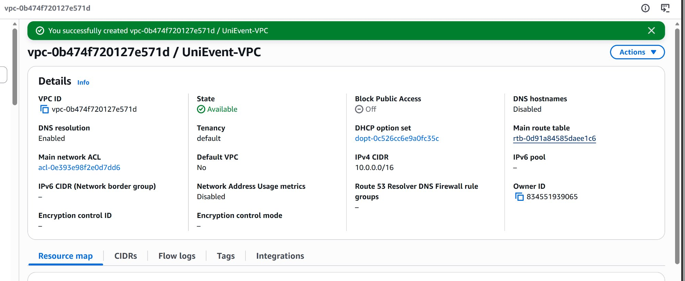

### 5.2 Subnet Configuration

Four subnets were created across two Availability Zones. Two public subnets (10.0.1.0/24 and 10.0.2.0/24) host the ALB and NAT Gateway. Two private subnets (10.0.10.0/24 and 10.0.20.0/24) host the EC2 application instances, ensuring they have no direct internet exposure.

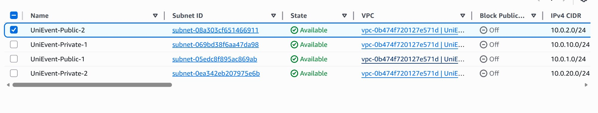

### 5.3 Internet Gateway

An Internet Gateway (`UniEvent-IGW`) was created and attached to the VPC, providing internet connectivity for resources in the public subnets. This is required for the ALB to receive external traffic and for the NAT Gateway to route outbound traffic from private subnets.

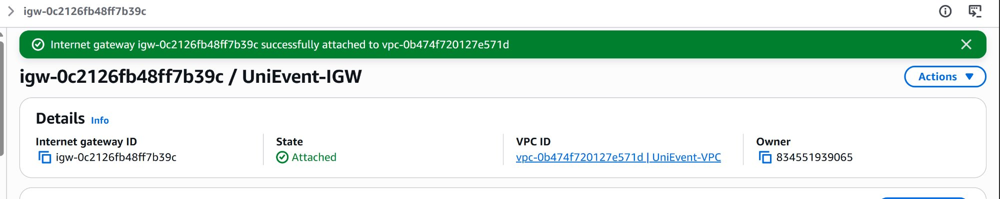

### 5.4 NAT Gateway

A NAT Gateway (`UniEvent-NAT`) was deployed in Public Subnet 1 with an automatically allocated Elastic IP (100.55.177.237). This enables the EC2 instances in private subnets to make outbound internet calls (for fetching events from the Ticketmaster API, downloading Python packages, and cloning the GitHub repository) without being directly reachable from the internet.

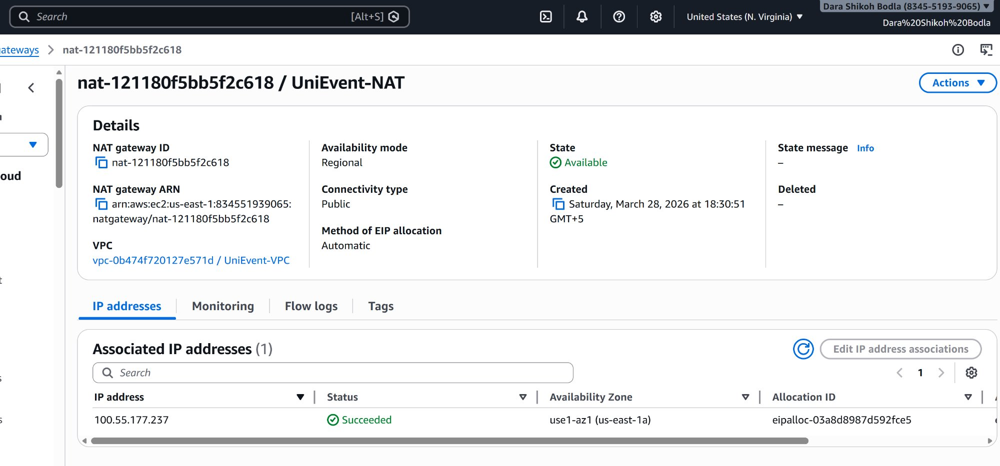

### 5.5 Route Tables

**Public Route Table** (`UniEvent-Public-RT`): Routes `0.0.0.0/0` through the Internet Gateway. Associated with both public subnets (2 explicit subnet associations).

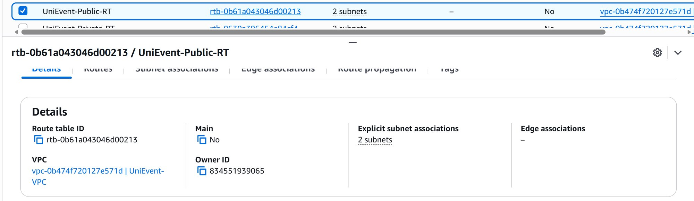

**Private Route Table** (`UniEvent-Private-RT`): Routes `0.0.0.0/0` through the NAT Gateway. Associated with both private subnets (2 explicit subnet associations). This ensures private instances can reach the internet for outbound calls only.

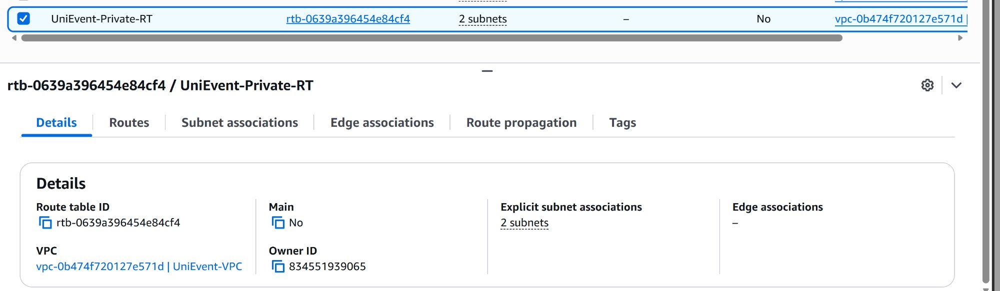

### 5.6 Security Groups

**ALB Security Group** (`UniEvent-ALB-SG`): Allows inbound HTTP (port 80) and HTTPS (port 443) traffic from anywhere (`0.0.0.0/0`). This is the only security group exposed to the public internet.

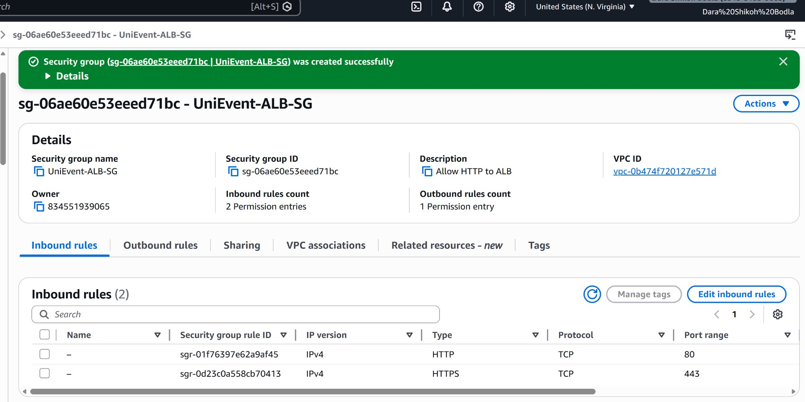

**EC2 Security Group** (`UniEvent-EC2-SG`): Allows inbound traffic only on port 5000 (application port) from the ALB Security Group, and SSH (port 22) for debugging. The EC2 instances cannot be reached directly from the internet — only the ALB can forward traffic to them. This is known as **security group chaining**.

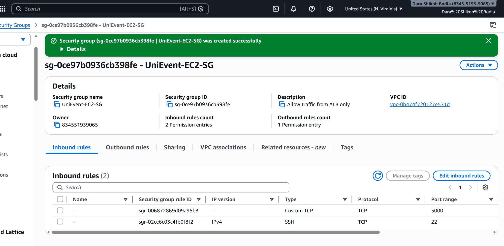

### 5.7 IAM Role and Instance Profile

The IAM Role (`UniEvent-EC2-Role`) was created with two policies: `AmazonSSMManagedInstanceCore` (AWS managed, for remote management via Session Manager) and a custom inline policy `UniEvent-S3-Access` granting scoped S3 permissions to the application bucket only. The Instance Profile ARN confirms the role is available for EC2 attachment.

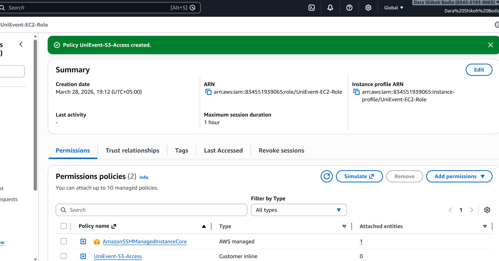

### 5.8 S3 Bucket

The S3 bucket (`unievent-media-dara26`) was created in us-east-1. A bucket policy was configured to allow public read access (`s3:GetObject`) only on the `event-images/*` and `event-posters/*` prefixes, keeping all other objects private.

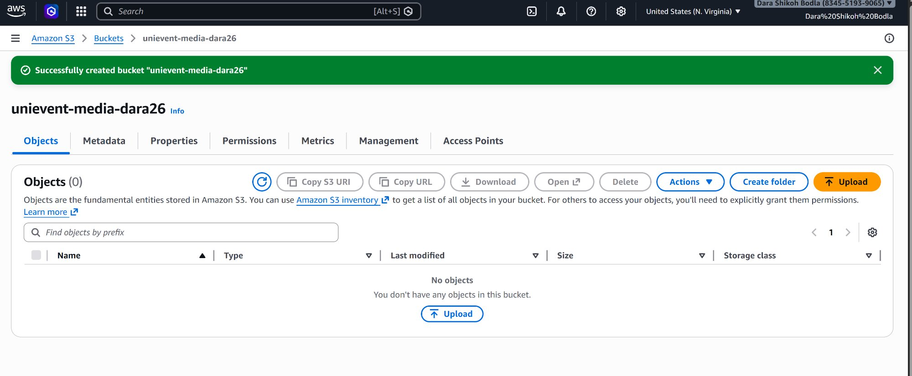

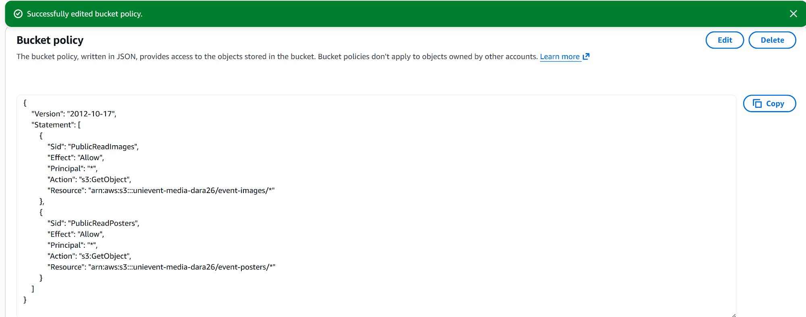

### 5.9 EC2 Instance Launch

Two EC2 instances (`t3.micro`, Amazon Linux 2023) were launched in private subnets with the `UniEvent-EC2-Role` IAM profile attached. A User Data bootstrap script automatically provisions each instance at boot: cloning the application from GitHub, installing Python dependencies with `pip3 install --ignore-installed`, writing environment configuration to a `.env` file, and registering a systemd service (`unievent.service`) that starts Gunicorn and auto-restarts on failure.

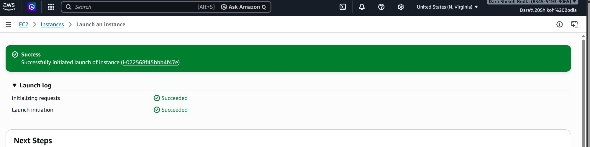

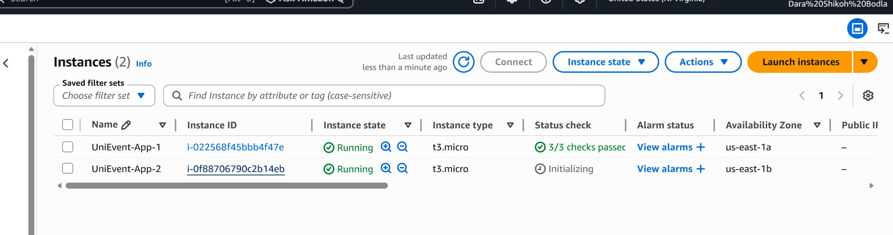

Both instances are running in separate Availability Zones (us-east-1a and us-east-1b) with all 3/3 status checks passing. Neither instance has a public IP — they are fully isolated in private subnets.

### 5.10 Application Load Balancer

The ALB (`UniEvent-ALB`) was created as internet-facing in both public subnets (us-east-1a and us-east-1b). Status is **Active**. An HTTP listener on port 80 forwards traffic to the `UniEvent-TG` target group, which routes requests to port 5000 on the EC2 instances with a `/health` health check path.

**DNS Name:** `UniEvent-ALB-1162431190.us-east-1.elb.amazonaws.com`

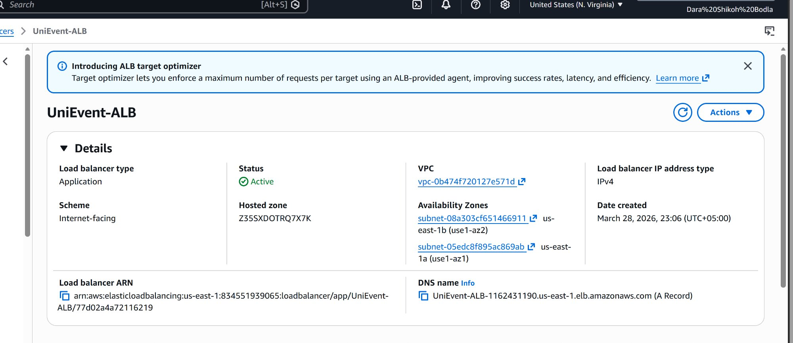

---

## 6. Verification and Testing

### 6.1 Health Check Endpoint

The `/health` endpoint confirms the application is running and has successfully cached 20 events from the Ticketmaster API. The ALB uses this endpoint every 30 seconds to determine instance health.

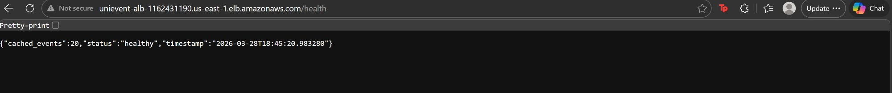

**Response:** `{"cached_events": 20, "status": "healthy", "timestamp": "2026-03-28T18:45:20.983280"}`

### 6.2 Target Group — All Targets Healthy

Both EC2 instances passed the ALB health checks and are registered as healthy (2 Healthy, 0 Unhealthy) in the target group. The ALB distributes traffic evenly across both instances.

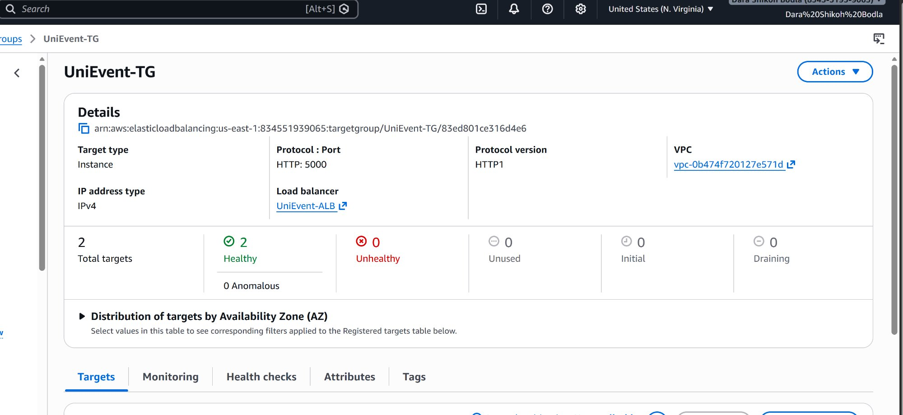

### 6.3 Live Application

The UniEvent homepage is accessible via the ALB DNS name. It displays 20 events fetched from the Ticketmaster API with event images, category tags (Sports, Arts & Theatre, Music, Miscellaneous), a live search bar, category filtering, and a refresh button. The "AWS Hosted" and "Auto-synced" badges confirm the deployment context.

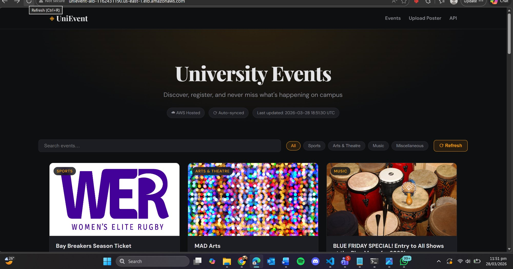

### 6.4 Fault Tolerance Test

To verify fault tolerance, one EC2 instance was stopped. The target group shows **1 Healthy, 0 Unhealthy, 1 Unused** (the stopped instance). The website continued to function without any downtime, served entirely by the remaining healthy instance. When the stopped instance was restarted, it automatically rejoined the target group after passing health checks.

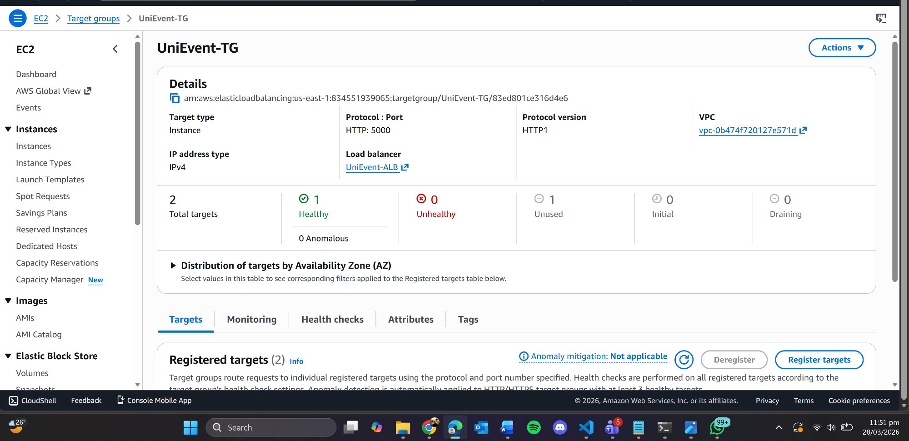

This confirms the system meets the requirement: **"The system must continue operating even if one EC2 instance fails."**

### 6.5 S3 Upload Functionality

A test image was uploaded through the web interface at `/upload`. The application successfully stored the file in the S3 bucket under the `event-posters/` prefix via the IAM Role (no hardcoded credentials) and returned the public S3 URL. The "Upload Successful ✓" confirmation is displayed with the image preview.

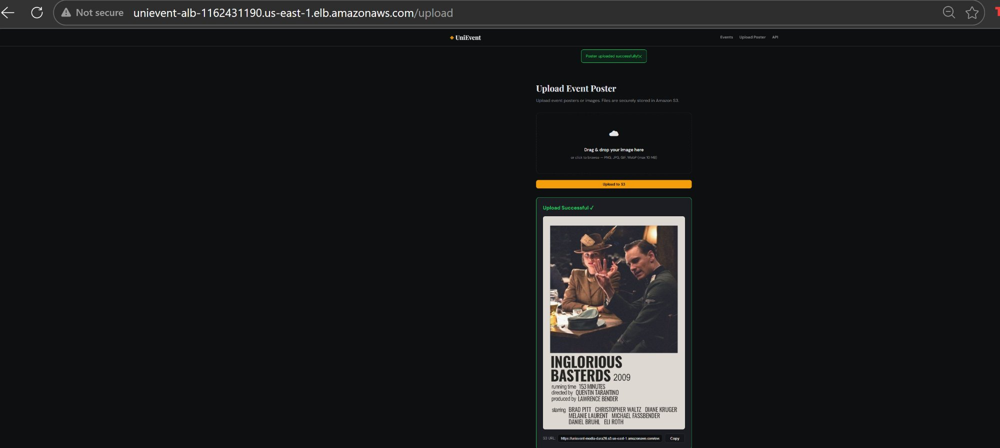

### 6.6 S3 Object Verification

The uploaded file (101.4 KB JPG) is confirmed present in the S3 bucket at `unievent-media-dara26/event-posters/`, verifying the end-to-end upload pipeline from the web interface through the EC2 application to S3 storage.

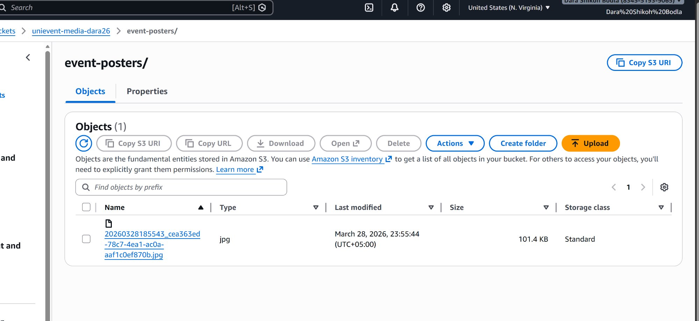

---

## 7. Security Analysis

| Layer | Implementation | Threat Mitigated |
|-------|---------------|-----------------|
| Network Isolation | EC2 instances in private subnets with no public IP | Direct access from internet |
| Security Group Chaining | EC2 SG accepts port 5000 only from ALB SG | Unauthorized port access |
| IAM Least Privilege | Instance Role with scoped S3 policy — no hardcoded credentials | Credential leakage |
| NAT Gateway | Private instances access internet outbound-only | Inbound exploitation |
| Input Validation | File uploads validated by extension; filenames sanitized via `secure_filename()` | Malicious file upload |
| S3 Access Control | Bucket policy restricts public read to specific prefixes only | Unauthorized data access |
| Environment Isolation | Secrets stored in `.env` file loaded via systemd `EnvironmentFile`, not in source code | Secret exposure in Git |

---

## 8. Alternative Deployment — CloudFormation

In addition to the manual console deployment documented above, the project includes a **CloudFormation template** (`infrastructure/cloudformation.yaml`) that creates the entire infrastructure stack as Infrastructure-as-Code.

### 8.1 Overview

CloudFormation is an AWS service that reads a declarative YAML template and automatically provisions all described resources in the correct dependency order. The provided template defines all 20+ resources (VPC, subnets, gateways, route tables, security groups, IAM role, S3 bucket, EC2 instances, ALB, target group, and listener) in a single 473-line file.

### 8.2 Comparison with Manual Deployment

| Aspect | Manual Console | CloudFormation |
|--------|---------------|----------------|
| Deployment time | 30-45 minutes | 5-10 minutes |
| Reproducibility | Depends on human accuracy | Identical every time |
| Error recovery | Manual rollback required | Automatic rollback on any failure |
| Cleanup | Delete 13+ resources individually | Single `delete-stack` command |
| Version control | Cannot track console clicks | Template is Git-versioned |
| Audit trail | CloudTrail logs only | Template IS the documentation |

### 8.3 Deployment and Cleanup

**Deploy (one command):**
```
aws cloudformation create-stack --stack-name UniEvent
  --template-body file://infrastructure/cloudformation.yaml
  --parameters ParameterKey=TicketmasterApiKey,ParameterValue=KEY
               ParameterKey=KeyPairName,ParameterValue=unievent-key
  --capabilities CAPABILITY_NAMED_IAM
```

**Cleanup (one command):**
```
aws cloudformation delete-stack --stack-name UniEvent
```

---

## 9. Repository Structure

```
Assignment1_AWS_CE/
├── README.md                              ← This report
├── app/
│   ├── app.py                             ← Flask application (routes, API, S3)
│   ├── gunicorn.conf.py                   ← Production server configuration
│   ├── requirements.txt                   ← Python dependencies
│   ├── templates/                         ← HTML templates (Jinja2)
│   │   ├── base.html, index.html,
│   │   ├── event_detail.html, upload.html
│   └── static/                            ← CSS and JavaScript
│       ├── css/style.css
│       └── js/main.js
├── infrastructure/
│   └── cloudformation.yaml                ← Full IaC template (20+ resources)
├── scripts/
│   ├── ec2-user-data.sh                   ← EC2 bootstrap script
│   ├── deploy-aws-cli.sh                  ← Automated CLI deployment
│   ├── cleanup.sh                         ← Resource teardown
│   └── local-setup.ps1                    ← Windows local dev setup
├── screenshots/                           ← Deployment evidence (20 images)
└── docs/
    ├── architecture-diagram.svg
    ├── API.md, API_JUSTIFICATION.md
    └── TESTING.md
```

---

## 10. Conclusion

The UniEvent system was successfully designed, deployed, and verified on AWS. The architecture demonstrates security awareness (private subnets, IAM roles, security group chaining), fault tolerance (multi-AZ deployment with ALB health checks), scalability (stateless application design with external storage), and cloud best practices (Infrastructure-as-Code, automated bootstrapping, environment-based configuration). All assignment requirements were met: the web application runs on multiple EC2 instances in private subnets, periodically fetches event data from an external API, stores images securely in S3, displays events to users, and continues operating when one instance fails.

---

## 11. References

- AWS VPC Documentation — https://docs.aws.amazon.com/vpc/
- AWS EC2 User Guide — https://docs.aws.amazon.com/ec2/
- AWS S3 Developer Guide — https://docs.aws.amazon.com/s3/
- AWS ELB Documentation — https://docs.aws.amazon.com/elasticloadbalancing/
- AWS IAM Best Practices — https://docs.aws.amazon.com/IAM/latest/UserGuide/best-practices.html
- AWS CloudFormation User Guide — https://docs.aws.amazon.com/cloudformation/
- Ticketmaster Discovery API v2 — https://developer.ticketmaster.com/products-and-docs/apis/discovery-api/v2/
- Flask Documentation — https://flask.palletsprojects.com/
- AWS Well-Architected Framework — https://aws.amazon.com/architecture/well-architected/
