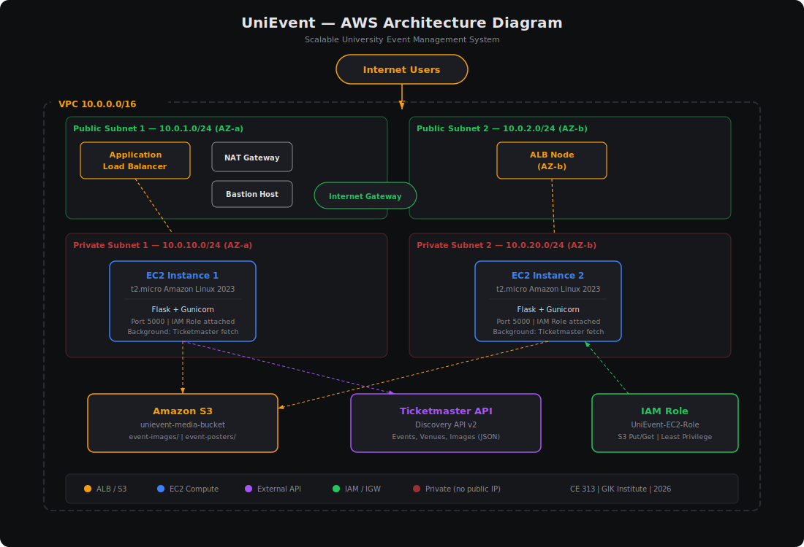

# UniEvent — Scalable University Event Management System on AWS

> **Course:** CE 313 — Cloud Computing  
> **Assignment:** 1 — AWS Architecture & Deployment  
> **Student:** Dara | Reg # 2023176  
> **Institute:** GIK Institute of Engineering Sciences & Technology  

---

## Table of Contents

1. [Project Overview](#1-project-overview)  
2. [Architecture Design](#2-architecture-design)  
3. [AWS Services Justification](#3-aws-services-justification)  
4. [API Selection & Justification](#4-api-selection--justification)  
5. [Repository Structure](#5-repository-structure)  
6. [Prerequisites](#6-prerequisites)  
7. [Step-by-Step Deployment Guide](#7-step-by-step-deployment-guide)  
   - 7.1 [Get a Ticketmaster API Key](#71-get-a-ticketmaster-api-key)  
   - 7.2 [Create the VPC & Networking](#72-create-the-vpc--networking)  
   - 7.3 [Create IAM Role & Instance Profile](#73-create-iam-role--instance-profile)  
   - 7.4 [Create the S3 Bucket](#74-create-the-s3-bucket)  
   - 7.5 [Create Security Groups](#75-create-security-groups)  
   - 7.6 [Launch EC2 Instances](#76-launch-ec2-instances)  
   - 7.7 [Configure the Application Load Balancer](#77-configure-the-application-load-balancer)  
   - 7.8 [Verify the Deployment](#78-verify-the-deployment)  
8. [Alternative: One-Click CloudFormation](#8-alternative-one-click-cloudformation)  
9. [Application Features](#9-application-features)  
10. [How Fault Tolerance Works](#10-how-fault-tolerance-works)  
11. [Security Measures](#11-security-measures)  
12. [Screenshots](#12-screenshots)  
13. [References](#13-references)  

---

## 1. Project Overview

**UniEvent** is a cloud-hosted web application that lets university students browse events, register for activities, and upload event posters. Instead of manual data entry, UniEvent **automatically fetches live event data** from the Ticketmaster Discovery API and presents them as official "University Events."

### Key Operational Flow

```
Internet Users
      │
      ▼
┌──────────────┐
│  Application │──── Public Subnets (2 AZs)
│  Load Balancer│
└──────┬───────┘
       │ HTTP :5000
       ▼
┌──────────────┐     ┌──────────────┐
│  EC2 App #1  │     │  EC2 App #2  │  ── Private Subnets (2 AZs)
│  (Flask +    │     │  (Flask +    │
│   Gunicorn)  │     │   Gunicorn)  │
└──────┬───────┘     └──────┬───────┘
       │                    │
       ▼                    ▼
   ┌────────┐        ┌─────────────┐
   │  S3    │        │ Ticketmaster│
   │ Bucket │        │ API (ext.)  │
   └────────┘        └─────────────┘
```

1. Users access the ALB's public DNS endpoint.  
2. ALB distributes requests across two EC2 instances in **private** subnets.  
3. Each EC2 instance runs the Flask app, which periodically calls the **Ticketmaster Discovery API** to fetch events.  
4. Fetched event images are mirrored into **Amazon S3** for reliable, fast delivery.  
5. Students can upload posters directly to S3 through the web interface.  
6. If one EC2 instance fails, the ALB health check detects it and routes all traffic to the healthy instance — **zero downtime**.

---

## 2. Architecture Design

### Architecture Diagram



### Network Topology (Text)

```
┌───────────────────────────────────────────────────────────────┐
│                        VPC  10.0.0.0/16                       │
│                                                               │
│  ┌─────────────────────┐      ┌─────────────────────┐        │
│  │  Public Subnet 1    │      │  Public Subnet 2    │        │
│  │  10.0.1.0/24 (AZ-a) │      │  10.0.2.0/24 (AZ-b) │        │
│  │                     │      │                     │        │
│  │  ┌───────────────┐  │      │                     │        │
│  │  │ NAT Gateway   │  │      │                     │        │
│  │  └───────────────┘  │      │                     │        │
│  │  ┌───────────────┐  │      │                     │        │
│  │  │ Bastion Host  │  │      │                     │        │
│  │  └───────────────┘  │      │                     │        │
│  │         ▲ ALB Node  │      │       ▲ ALB Node    │        │
│  └─────────┼───────────┘      └───────┼─────────────┘        │
│            │                          │                       │
│  ┌─────────┼───────────┐      ┌───────┼─────────────┐        │
│  │  Private│Subnet 1   │      │  Priv.│Subnet 2     │        │
│  │  10.0.10.0/24(AZ-a) │      │  10.0.20.0/24(AZ-b) │        │
│  │                     │      │                     │        │
│  │  ┌───────────────┐  │      │  ┌───────────────┐  │        │
│  │  │ EC2 App #1    │  │      │  │ EC2 App #2    │  │        │
│  │  │ Flask+Gunicorn│  │      │  │ Flask+Gunicorn│  │        │
│  │  └───────────────┘  │      │  └───────────────┘  │        │
│  └─────────────────────┘      └─────────────────────┘        │
│                                                               │
│           Internet Gateway ←→ Internet                        │
└───────────────────────────────────────────────────────────────┘

        External:  Ticketmaster Discovery API
        Storage:   Amazon S3 (event-images/, event-posters/)
```

### Component Roles

| Component | Purpose |
|-----------|---------|
| **VPC** | Isolated virtual network with CIDR `10.0.0.0/16` |
| **Public Subnets** (×2) | Host the ALB nodes, NAT Gateway, and Bastion |
| **Private Subnets** (×2) | Host the EC2 application instances (no direct internet) |
| **Internet Gateway** | Provides internet connectivity to public subnets |
| **NAT Gateway** | Lets private instances access the internet (API calls, updates) without being directly reachable |
| **ALB** | Distributes HTTP traffic, performs health checks |
| **EC2 Instances** (×2) | Run the Flask/Gunicorn app in separate AZs |
| **S3 Bucket** | Stores event images and uploaded posters |
| **IAM Role** | Grants EC2 instances scoped S3 permissions — no hard-coded keys |
| **Security Groups** | Firewall rules: ALB accepts 80/443, EC2 accepts 5000 only from ALB |

---

## 3. AWS Services Justification

### 3.1 IAM (Identity & Access Management)

**Why:** EC2 instances need to read/write objects in S3. Instead of embedding AWS credentials in code (a security anti-pattern), we create an **IAM Role** attached to an **Instance Profile**. The role grants only the S3 actions the app needs (`s3:PutObject`, `s3:GetObject`, `s3:ListBucket`, `s3:DeleteObject`) scoped to a single bucket. This follows the **Principle of Least Privilege**.

### 3.2 VPC (Virtual Private Cloud)

**Why:** A VPC provides **network isolation**. We segment resources into public and private subnets across **two Availability Zones** for fault tolerance. The EC2 instances live in **private subnets** — they have no public IP and cannot be reached directly from the internet. Only the ALB (in public subnets) is internet-facing. A **NAT Gateway** lets the private instances make outbound calls (to the Ticketmaster API and S3) without exposing inbound ports.

### 3.3 EC2 (Elastic Compute Cloud)

**Why:** EC2 provides full control over the compute environment. We deploy **two t2.micro instances** in separate AZs, each running the Flask application behind Gunicorn (a production WSGI server). Two instances provide **redundancy** — if one AZ experiences an outage, the other AZ continues serving traffic.

### 3.4 S3 (Simple Storage Service)

**Why:** S3 provides **99.999999999% durability** for stored objects. Event images fetched from the API are mirrored into S3, and student-uploaded posters are stored there. S3 also offers static asset serving and bucket policies for controlled public read access. This offloads storage from the EC2 instances and prevents data loss on instance termination.

### 3.5 Elastic Load Balancing (ALB)

**Why:** The **Application Load Balancer** is the single entry point for all user traffic. It performs **health checks** (`GET /health` every 30 seconds) on both EC2 instances. If an instance fails the health check three consecutive times, the ALB stops routing traffic to it. When the instance recovers, traffic is automatically restored. This is the core of our **fault tolerance** strategy.

---

## 4. API Selection & Justification

### Selected API: **Ticketmaster Discovery API v2**

| Criterion | Evaluation |
|-----------|------------|
| **Structured JSON** | Returns well-structured JSON with events, venues, images, dates, classifications |
| **Event Fields** | `name` (title), `dates.start.localDate` (date), `venues[].name` (venue), `info` (description), `images[]` (posters) |
| **Free Tier** | 5,000 requests/day — more than sufficient |
| **Documentation** | Comprehensive official docs at developer.ticketmaster.com |
| **Reliability** | Production-grade API backed by Ticketmaster/Live Nation |
| **Authentication** | Simple API key as a query parameter |
| **Image Availability** | Returns multiple image sizes and ratios per event |

**Why not Eventbrite?** Eventbrite's API requires OAuth 2.0 even for public events, which adds unnecessary complexity. Ticketmaster uses a simple API key, making it more suitable for this demonstration.

**API Endpoint Used:**
```
GET https://app.ticketmaster.com/discovery/v2/events.json
    ?apikey=YOUR_KEY
    &size=20
    &sort=date,asc
    &classificationName=Music,Arts,Sports,Education,Festival
    &countryCode=US
```

**Sample Response Fields Mapped:**

```json
{
  "id": "vvG1IZ9YLkLfRB",
  "name": "Spring Music Festival",           → title
  "dates": { "start": { "localDate": "2026-04-15" } },  → date
  "_embedded": { "venues": [{ "name": "University Arena" }] },  → venue
  "info": "Annual spring music celebration",  → description
  "images": [{ "url": "https://..." }]       → image_url (mirrored to S3)
}
```

---

## 5. Repository Structure

```
Assignment1_AWS_CE/
├── README.md                          ← This file
├── .gitignore
│
├── app/                               ← Application source code
│   ├── app.py                         ← Main Flask application
│   ├── gunicorn.conf.py               ← Gunicorn production config
│   ├── requirements.txt               ← Python dependencies
│   ├── .env.example                   ← Environment variables template
│   ├── templates/
│   │   ├── base.html                  ← Shared layout template
│   │   ├── index.html                 ← Events listing page
│   │   ├── event_detail.html          ← Single event detail page
│   │   └── upload.html                ← Poster upload page
│   └── static/
│       ├── css/
│       │   └── style.css              ← Main stylesheet
│       └── js/
│           └── main.js                ← Client-side JavaScript
│
├── infrastructure/
│   └── cloudformation.yaml            ← Full AWS CloudFormation template
│
├── scripts/
│   ├── ec2-user-data.sh               ← EC2 bootstrap script (User Data)
│   ├── deploy-aws.sh                  ← Automated full AWS CLI deployment
│   └── cleanup-aws.sh                 ← Tear down all AWS resources
│
└── docs/
    ├── architecture-diagram.svg       ← Visual AWS architecture diagram
    ├── API_JUSTIFICATION.md           ← API evaluation & selection rationale
    ├── TESTING.md                     ← Full testing & verification guide
    └── LOCAL_DEVELOPMENT.md           ← Run the app locally before deploying
```

---

## 6. Prerequisites

Before deploying, ensure you have:

- [x] An **AWS Account** with admin access
- [x] An **EC2 Key Pair** created in your target region
- [x] **AWS CLI v2** installed and configured (`aws configure`)
- [x] A **Ticketmaster API Key** (free at [developer.ticketmaster.com](https://developer.ticketmaster.com/))
- [x] **Git** installed locally

---

## 7. Step-by-Step Deployment Guide

### 7.1 Get a Ticketmaster API Key

1. Go to [developer.ticketmaster.com](https://developer.ticketmaster.com/)
2. Click **"Get Your API Key"** and create an account
3. After login, navigate to **My Apps** → your default app
4. Copy the **Consumer Key** — this is your API key
5. Save it securely; you will need it in Step 7.6

### 7.2 Create the VPC & Networking

#### Step A: Create the VPC

1. Open **AWS Console** → **VPC** → **Your VPCs** → **Create VPC**
2. Configure:
   - **Name tag:** `UniEvent-VPC`
   - **IPv4 CIDR block:** `10.0.0.0/16`
3. Click **Create VPC**

#### Step B: Create Subnets

Create **four** subnets:

| Name | CIDR | AZ | Type |
|------|------|----|------|
| `UniEvent-Public-1` | `10.0.1.0/24` | us-east-1a | Public |
| `UniEvent-Public-2` | `10.0.2.0/24` | us-east-1b | Public |
| `UniEvent-Private-1` | `10.0.10.0/24` | us-east-1a | Private |
| `UniEvent-Private-2` | `10.0.20.0/24` | us-east-1b | Private |

For each: **VPC** → **Subnets** → **Create subnet** → Select `UniEvent-VPC` → fill in name, CIDR, AZ.

For the two **public** subnets, also:
- Select the subnet → **Actions** → **Edit subnet settings** → Enable **Auto-assign public IPv4 address**

#### Step C: Create & Attach Internet Gateway

1. **VPC** → **Internet Gateways** → **Create internet gateway**
   - Name: `UniEvent-IGW`
2. Select it → **Actions** → **Attach to VPC** → Select `UniEvent-VPC`

#### Step D: Create NAT Gateway

1. **VPC** → **NAT Gateways** → **Create NAT gateway**
   - **Subnet:** `UniEvent-Public-1`
   - **Elastic IP:** Click **Allocate Elastic IP** then select it
   - **Name:** `UniEvent-NAT`
2. Click **Create NAT gateway**

#### Step E: Configure Route Tables

**Public Route Table:**

1. **VPC** → **Route Tables** → **Create route table**
   - Name: `UniEvent-Public-RT`, VPC: `UniEvent-VPC`
2. Select it → **Routes** tab → **Edit routes** → **Add route:**
   - Destination: `0.0.0.0/0`, Target: `UniEvent-IGW`
3. **Subnet associations** tab → **Edit** → Associate `UniEvent-Public-1` and `UniEvent-Public-2`

**Private Route Table:**

1. Create another route table: `UniEvent-Private-RT`
2. **Edit routes** → **Add route:**
   - Destination: `0.0.0.0/0`, Target: `UniEvent-NAT`
3. Associate `UniEvent-Private-1` and `UniEvent-Private-2`

### 7.3 Create IAM Role & Instance Profile

1. Open **IAM** → **Roles** → **Create role**
2. **Trusted entity type:** AWS Service → **EC2**
3. **Permissions:** Attach `AmazonSSMManagedInstanceCore` (for management)
4. Click **Next** → **Role name:** `UniEvent-EC2-Role` → **Create role**
5. Open the newly created role → **Add permissions** → **Create inline policy** → **JSON** tab:

```json
{
  "Version": "2012-10-17",
  "Statement": [
    {
      "Effect": "Allow",
      "Action": [
        "s3:PutObject",
        "s3:GetObject",
        "s3:ListBucket",
        "s3:DeleteObject"
      ],
      "Resource": [
        "arn:aws:s3:::unievent-media-YOURACCOUNTID",
        "arn:aws:s3:::unievent-media-YOURACCOUNTID/*"
      ]
    }
  ]
}
```

6. Name the policy `UniEvent-S3-Access` → **Create policy**

### 7.4 Create the S3 Bucket

1. Open **S3** → **Create bucket**
2. **Bucket name:** `unievent-media-YOURACCOUNTID` (must be globally unique)
3. **Region:** Same as your VPC (e.g., `us-east-1`)
4. **Uncheck** "Block all public access" (we need public read for images)
   - Acknowledge the warning
5. Click **Create bucket**

#### Set Bucket Policy for Public Read

1. Open the bucket → **Permissions** → **Bucket Policy** → paste:

```json
{
  "Version": "2012-10-17",
  "Statement": [
    {
      "Sid": "PublicReadImages",
      "Effect": "Allow",
      "Principal": "*",
      "Action": "s3:GetObject",
      "Resource": "arn:aws:s3:::unievent-media-YOURACCOUNTID/event-images/*"
    },
    {
      "Sid": "PublicReadPosters",
      "Effect": "Allow",
      "Principal": "*",
      "Action": "s3:GetObject",
      "Resource": "arn:aws:s3:::unievent-media-YOURACCOUNTID/event-posters/*"
    }
  ]
}
```

#### Enable CORS

1. **Permissions** → **CORS configuration**:

```json
[
  {
    "AllowedHeaders": ["*"],
    "AllowedMethods": ["GET"],
    "AllowedOrigins": ["*"],
    "MaxAgeSeconds": 3600
  }
]
```

### 7.5 Create Security Groups

Navigate to **VPC** → **Security Groups** → **Create security group** for each:

#### ALB Security Group

| Field | Value |
|-------|-------|
| **Name** | `UniEvent-ALB-SG` |
| **VPC** | `UniEvent-VPC` |
| **Inbound Rule 1** | HTTP (80) from `0.0.0.0/0` |
| **Inbound Rule 2** | HTTPS (443) from `0.0.0.0/0` |

#### EC2 Security Group

| Field | Value |
|-------|-------|
| **Name** | `UniEvent-EC2-SG` |
| **VPC** | `UniEvent-VPC` |
| **Inbound Rule 1** | Custom TCP (5000) from `UniEvent-ALB-SG` |
| **Inbound Rule 2** | SSH (22) from `UniEvent-Bastion-SG` |

#### Bastion Security Group

| Field | Value |
|-------|-------|
| **Name** | `UniEvent-Bastion-SG` |
| **VPC** | `UniEvent-VPC` |
| **Inbound Rule 1** | SSH (22) from `YOUR_IP/32` |

### 7.6 Launch EC2 Instances

#### Launch App Instance 1

1. **EC2** → **Launch Instances**
2. **Name:** `UniEvent-App-1`
3. **AMI:** Amazon Linux 2023
4. **Instance type:** `t2.micro` (free tier)
5. **Key pair:** Select your existing key pair
6. **Network settings:**
   - VPC: `UniEvent-VPC`
   - Subnet: `UniEvent-Private-1`
   - Auto-assign public IP: **Disable**
   - Security group: `UniEvent-EC2-SG`
7. **Advanced details:**
   - IAM instance profile: `UniEvent-EC2-Role`
   - User data: paste the contents of `scripts/ec2-user-data.sh`
     - **Replace** `<YOUR_GITHUB_USERNAME>` with your GitHub username
     - **Replace** `REPLACE_WITH_YOUR_TICKETMASTER_KEY` with your actual key
     - **Replace** `unievent-media-bucket` with your actual bucket name
8. Click **Launch instance**

#### Launch App Instance 2

Repeat the above but:
- **Name:** `UniEvent-App-2`
- **Subnet:** `UniEvent-Private-2`

#### Launch Bastion Host (optional, for debugging)

- **Name:** `UniEvent-Bastion`
- **Subnet:** `UniEvent-Public-1`
- **Security group:** `UniEvent-Bastion-SG`
- No user data needed

### 7.7 Configure the Application Load Balancer

#### Step A: Create Target Group

1. **EC2** → **Target Groups** → **Create target group**
2. Target type: **Instances**
3. **Name:** `UniEvent-TG`
4. **Protocol:** HTTP, **Port:** 5000
5. **VPC:** `UniEvent-VPC`
6. **Health check path:** `/health`
7. **Advanced settings:**
   - Healthy threshold: 2
   - Unhealthy threshold: 3
   - Interval: 30 seconds
8. Click **Next** → Select `UniEvent-App-1` and `UniEvent-App-2` → **Include as pending** → **Create target group**

#### Step B: Create the ALB

1. **EC2** → **Load Balancers** → **Create Load Balancer** → **Application Load Balancer**
2. **Name:** `UniEvent-ALB`
3. **Scheme:** Internet-facing
4. **IP type:** IPv4
5. **Network mapping:**
   - VPC: `UniEvent-VPC`
   - Select **both** public subnets
6. **Security group:** `UniEvent-ALB-SG`
7. **Listener:** HTTP : 80 → Forward to `UniEvent-TG`
8. Click **Create load balancer**

#### Step C: Get the ALB DNS Name

1. Go to **Load Balancers** → Select `UniEvent-ALB`
2. Copy the **DNS name** (e.g., `UniEvent-ALB-123456789.us-east-1.elb.amazonaws.com`)
3. Open it in your browser: `http://<ALB-DNS-NAME>`

### 7.8 Verify the Deployment

1. **Health check:** Visit `http://<ALB-DNS-NAME>/health`
   - Should return `{"status": "healthy", "cached_events": 20}`

2. **Events page:** Visit `http://<ALB-DNS-NAME>/`
   - Should display a grid of events fetched from Ticketmaster

3. **Upload test:** Visit `http://<ALB-DNS-NAME>/upload`
   - Upload a test image → confirm it appears with an S3 URL

4. **Fault tolerance test:**
   - Go to EC2 Console → Stop `UniEvent-App-1`
   - Wait ~90 seconds for health check to mark it unhealthy
   - Refresh the website — it should still work (served by App-2)
   - Start App-1 again → ALB automatically adds it back

5. **API endpoint:** Visit `http://<ALB-DNS-NAME>/api/events`
   - Should return JSON array of all cached events

---

## 8. Alternative: One-Click CloudFormation

Instead of doing everything manually, you can deploy the entire stack using the provided CloudFormation template.

**On Linux/Mac (bash):**
```bash
aws cloudformation create-stack \
  --stack-name UniEvent \
  --template-body file://infrastructure/cloudformation.yaml \
  --parameters \
    ParameterKey=TicketmasterApiKey,ParameterValue=YOUR_KEY \
    ParameterKey=KeyPairName,ParameterValue=YOUR_KEYPAIR \
  --capabilities CAPABILITY_NAMED_IAM
```

**On Windows (PowerShell):**
```powershell
aws cloudformation create-stack `
  --stack-name UniEvent `
  --template-body file://infrastructure/cloudformation.yaml `
  --parameters `
    ParameterKey=TicketmasterApiKey,ParameterValue=YOUR_KEY `
    ParameterKey=KeyPairName,ParameterValue=YOUR_KEYPAIR `
  --capabilities CAPABILITY_NAMED_IAM
```

Monitor progress:
```
aws cloudformation describe-stacks --stack-name UniEvent --query "Stacks[0].StackStatus"
```

Get the ALB URL:
```
aws cloudformation describe-stacks --stack-name UniEvent --query "Stacks[0].Outputs[?OutputKey=='ALBEndpoint'].OutputValue" --output text
```

---

## 9. Application Features

| Feature | Description |
|---------|-------------|
| **Auto-Fetch Events** | Background thread calls Ticketmaster API every 30 minutes |
| **Event Listing** | Responsive grid with search and category filters |
| **Event Detail** | Full event page with date, venue, description, image |
| **Poster Upload** | Drag-and-drop image upload directly to S3 |
| **Health Check** | `/health` endpoint for ALB monitoring |
| **REST API** | `/api/events` returns cached events as JSON |
| **Manual Refresh** | `/api/refresh` triggers an immediate API fetch |
| **S3 Image Mirror** | Event images from Ticketmaster are copied to S3 for reliability |

---

## 10. How Fault Tolerance Works

```
Normal operation:        One instance fails:
                        
  User ──→ ALB          User ──→ ALB
            │ ╲                   │
            ▼  ▼                  ▼
         App1  App2            App2 (healthy)
                               App1 ✗ (unhealthy, removed from rotation)
```

1. ALB performs `GET /health` on both instances every **30 seconds**
2. If an instance fails **3 consecutive** health checks, the ALB marks it **unhealthy**
3. All traffic is routed to the remaining healthy instance
4. When the failed instance recovers and passes **2 consecutive** checks, it is added back
5. Instances are in **separate Availability Zones**, so even an entire data center failure is survivable

---

## 11. Security Measures

| Layer | Measure |
|-------|---------|
| **Network** | EC2 instances in **private subnets** — no public IP, no direct access |
| **Firewall** | EC2 Security Group only allows port 5000 from the ALB SG |
| **IAM** | Instance Role with **least-privilege** S3 policy — no hard-coded credentials |
| **NAT** | Private instances access internet via NAT Gateway (outbound only) |
| **Bastion** | SSH to private instances only via a bastion host in the public subnet |
| **S3** | Bucket policy restricts public read to specific prefixes (`event-images/`, `event-posters/`) |
| **Input** | File uploads validated by extension; filenames sanitized via `secure_filename()` |
| **HTTPS** | ALB supports HTTPS listener (requires ACM certificate — optional for demo) |

---

## 12. Screenshots

> **Note:** Add screenshots of the following after deployment:
> 
> 1. VPC with subnets visible in the console
> 2. EC2 instances running in private subnets
> 3. ALB with healthy target group
> 4. S3 bucket with event images
> 5. UniEvent homepage displaying events
> 6. Event detail page
> 7. Upload page with successful S3 upload
> 8. `/health` endpoint response
> 9. Fault tolerance test — one instance stopped, site still working

---

## 13. References

- AWS VPC Documentation: https://docs.aws.amazon.com/vpc/
- AWS EC2 User Guide: https://docs.aws.amazon.com/ec2/
- AWS S3 Developer Guide: https://docs.aws.amazon.com/s3/
- AWS ELB Documentation: https://docs.aws.amazon.com/elasticloadbalancing/
- AWS IAM Best Practices: https://docs.aws.amazon.com/IAM/latest/UserGuide/best-practices.html
- Ticketmaster Discovery API: https://developer.ticketmaster.com/products-and-docs/apis/discovery-api/v2/
- Flask Documentation: https://flask.palletsprojects.com/
- Gunicorn Documentation: https://docs.gunicorn.org/
- AWS Well-Architected Framework: https://aws.amazon.com/architecture/well-architected/

---

**Developed for CE 313 Cloud Computing — GIK Institute — 2026**
